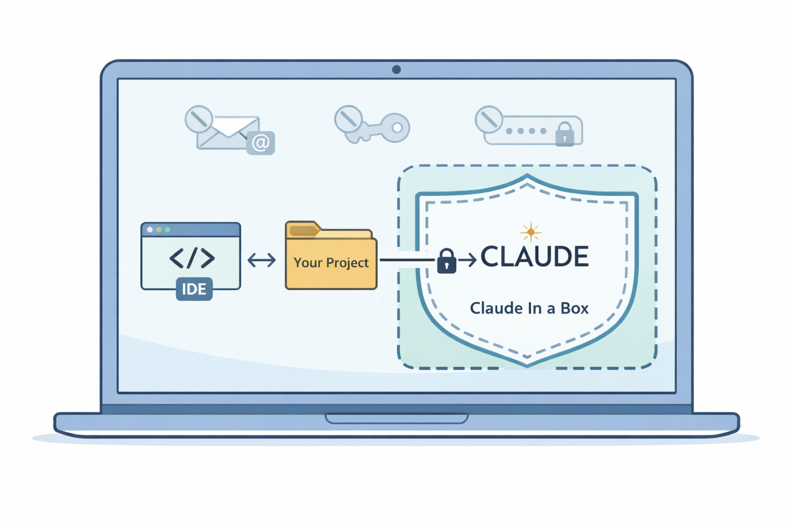

# Claude In A Box

A custom Docker environment for running [Claude Code](https://github.com/anthropics/claude-code) with enhanced security
and specialized development tooling via image variants.

## How It Works

<div align="center">
  
  <p><em>Your IDE retains full system access while Claude Code is sandboxed to your project only</em></p>
</div>

## Features

**All variants include:**

- **🤖 Claude Code CLI** - Official Anthropic AI coding assistant
- **🎨 ZSH with Powerline10k** - Beautiful and functional shell environment
- **📦 Development Tools** - git, gh CLI, fzf, vim, nano, jq, and more
- **🎭 Playwright Testing** - E2E testing with Firefox
- **🔒 Enhanced Security** - Network firewall restricting outbound access to approved domains only
- **📊 Git Delta** - Syntax-highlighted git diffs for better code review
- **🗂️ Per-Project Isolation** - Separate Claude settings and GitHub tokens per project
- **💾 Command History** - Persistent ZSH history across sessions

**Image variants:**

- **☕ `java_quarkus`** - Adds SDKMAN, GraalVM (Java 21/24/25), and Quarkus 3.29.0
- **🦋 `flutter`** - Extends java_quarkus, adds Flutter SDK (forces linux/amd64 on ARM for compatibility)

## Prerequisites

Before using this Docker environment, ensure you have the following ready:

- **Docker** - [Install Docker](https://docs.docker.com/get-docker/) for your platform
- **[A fine-grained GitHub Token](https://docs.github.com/en/authentication/keeping-your-account-and-data-secure/managing-your-personal-access-tokens#creating-a-fine-grained-personal-access-token)** – optional, for using the `gh` CLI tool

## How It Looks

<div align="center">
  
</div>

## Installation and Usage

### 1. Clone the Repository

```zsh
git clone https://github.com/abuechler/claude-in-a-box.git
cd claude-in-a-box
```

### 2. Add the `clc` Script to Your PATH

For ZSH users, add the script directory to your PATH by adding this line to your `~/.zshrc`:

```zsh
# Add Claude In A Box clc script to PATH
export PATH="$PATH:/path/to/claude-in-a-box"
```

Replace `/path/to/claude-in-a-box` with the actual absolute path where you cloned this repository.

After editing `~/.zshrc`, reload your shell configuration:

```zsh
source ~/.zshrc
```

### 3. Run Claude Code

Navigate to any project directory and run:

```zsh
clc
```

The first time you run `clc`, it will:

- **Prompt you to select an image variant:**
    - `java_quarkus` - Native architecture, adds SDKMAN/GraalVM/Java/Quarkus to base
    - `flutter` - Extends java_quarkus, adds Flutter SDK, forces linux/amd64 (runs via Rosetta on ARM)
- Save your selection to `.claude_in_a_box` in your project directory
- Automatically build the Docker image(s) (this may take several minutes)
- Create per-project settings in `~/.claude_project_settings/<project-name>/`
- Launch a ZSH shell inside the Docker container with your project mounted
- **Now you can run `claude-yolo` which is an alias for `claude --allow-dangerously-skip-permissions`**

> 🧨 Running claude in YOLO mode skips any permission prompts, use it only inside a trusted environment, like inside a
> Docker container. If you want to run claude without YOLO mode, just run `claude` instead of `claude-yolo`. But you
> will note that you cannot let claude do long-running tasks without watching them, because you will certainly miss
> permission prompts.

### 4. Configuration

#### Image Variant

The image variant is stored in your project's `.claude_in_a_box` file:

```bash
project_name="my-project"
image_variant="java_quarkus"  # or "flutter"
```

To switch variants, edit this file or delete the `image_variant` line to be prompted again.

#### Per-Project Settings

Each project gets its own settings directory at `~/.claude_project_settings/<project-name>/` containing:

- `claude/` - Claude-specific configuration and history
- `claude.json` - Claude settings file
- `shell_history/` - Persistent ZSH history across container sessions
- `.gh_token` - GitHub token for this project (optional)
- `.github-app-key.pem` - GitHub App private key (optional, for GitHub App auth)
- `github-app-token.sh` - Script to generate GitHub App tokens (optional)

#### Global Settings

The `~/.claude-in-a-box/` directory (in your $HOME directory) is mounted read-only into all containers. Use this for:

- **Automatic initialization**: Create an executable `init.sh` script that runs at container startup, useful for setting
  up git credentials etc. See the example in [`examples/init.sh`](examples/init.sh).
- **Skills sync**: Place [Claude Code skills](https://code.claude.com/docs/en/skills) in `~/.claude-in-a-box/skills/`
  and they'll be automatically synced into each container's `~/.claude/skills/` directory at startup (requires `init.sh`
  from the example).
- **Shared configuration**: Files that should be available across all projects

#### GitHub Token Setup

To use the `gh` CLI tool, create a GitHub fine-grained token and save it to:

```zsh
~/.claude_project_settings/<project-name>/.gh_token
```

The token will be automatically loaded when you start the container.

#### GitHub App Authentication (Alternative)

For more granular permissions or organization-level access, you can use GitHub App authentication instead of a personal
token:

1. Create a GitHub App in your organization/account settings
2. Generate and download a private key for the App
3. Save the private key to:
   ```zsh
   ~/.claude_project_settings/<project-name>/.github-app-key.pem
   ```
4. Create a token generation script at:
   ```zsh
   ~/.claude_project_settings/<project-name>/github-app-token.sh
   ```

Both files are mounted read-only into the container at `/home/node/`.

#### Setting Up Git Credentials

Use the provided example script to set up git credentials automatically:

```zsh
# Copy the example init script to your global settings
# Edit init.sh and replace YOUR_NAME and YOUR_EMAIL with your details
cp examples/init.sh ~/.claude-in-a-box/
chmod +x ~/.claude-in-a-box/init.sh

# Create a GitHub token file (either globally or per-project)
echo "your_github_token" > ~/.gh_token
# OR for per-project:
echo "your_github_token" > ~/.claude_project_settings/<project-name>/.gh_token
```

The init script will configure git credentials automatically when the container starts.

### 5. Initialize Firewall (Optional)

> ⚠️ Although this is optional, this step is highly recommended!

#### Linux

Inside the container, you can initialize the network firewall to restrict outbound access, if your setup allows
modifications of the host's firewall rules.

```zsh
sudo /usr/local/bin/init-firewall.sh
```

This limits network access to approved domains (GitHub, npm, Anthropic APIs, etc.) for enhanced security.

#### macOS

On macOS there is no `iptables` support, a user-friendly way to manage the firewall is by
installing [Little Snitch](https://www.obdev.at/products/littlesnitch/index.html), which is totally worth the money. If
you've installed it, make sure to delete any global allow rule for the Docker binary and then add the rules as needed.
Depending on the mode you run it, it will ask you for every new connection attempt.

### 6. Update Claude In A Box

To update to the latest version and start Claude In A Box. This will build a new Docker image:

```zsh
git pull origin main
clc
```
